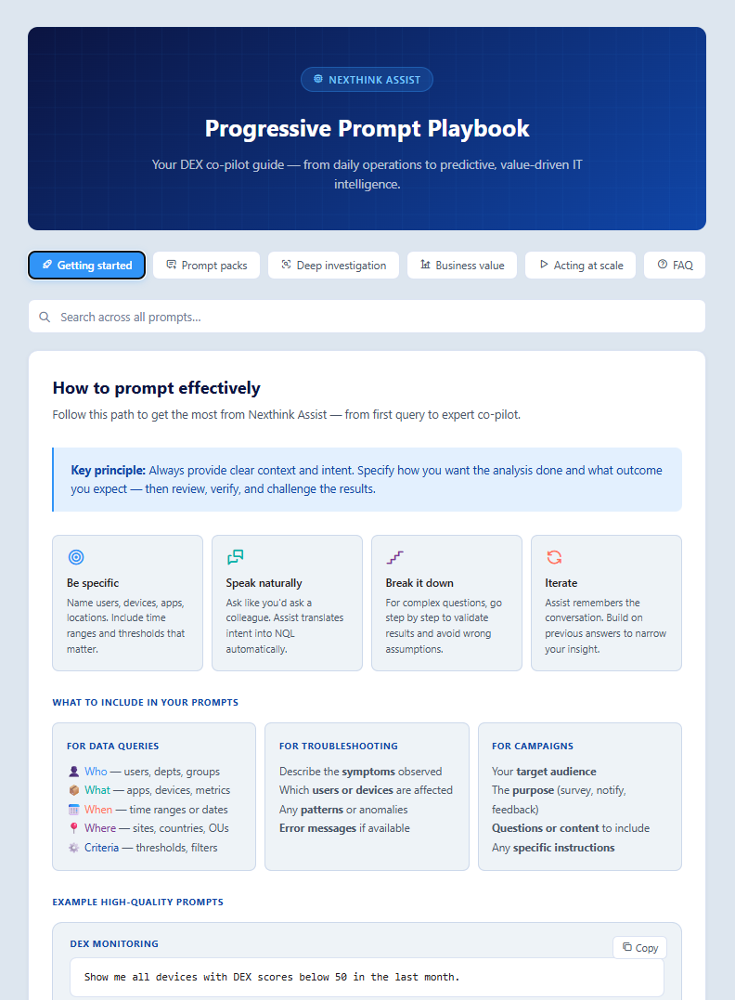
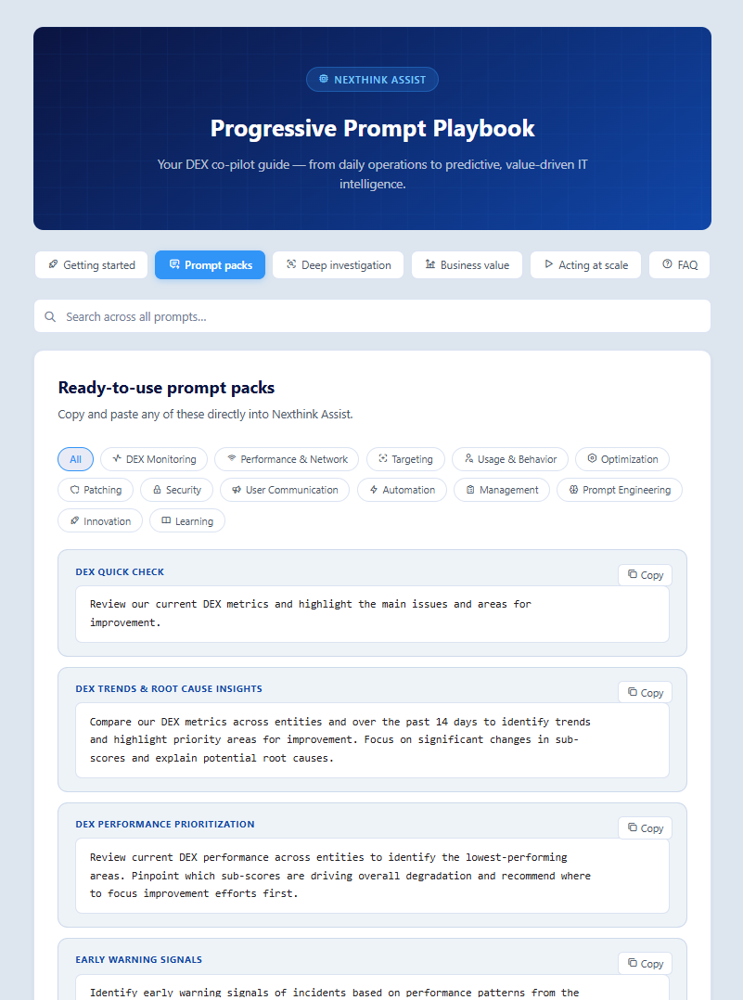
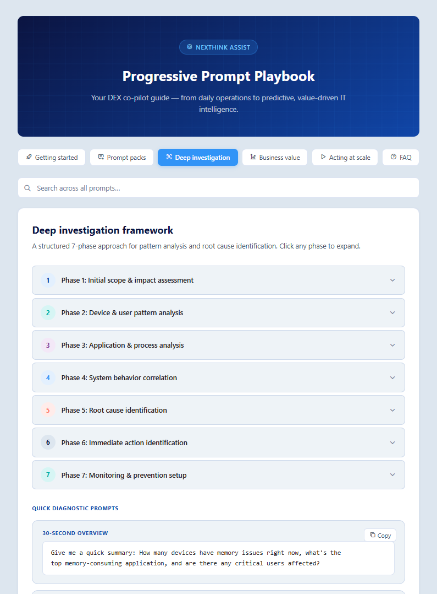
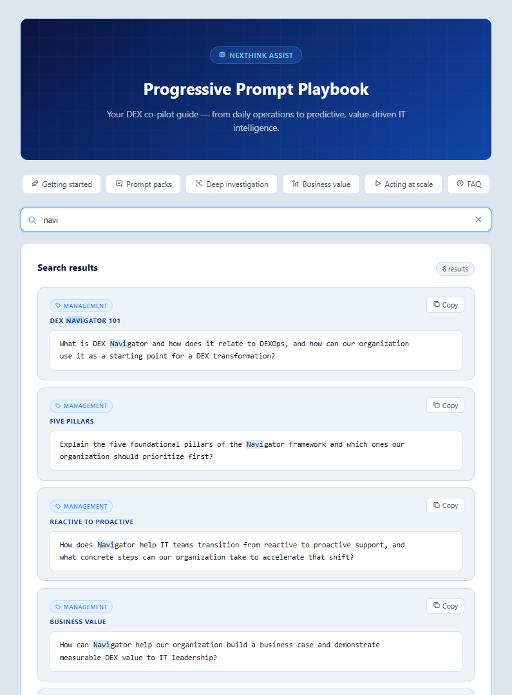

# Nexthink Assist – Progressive Prompt Playbook

A structured, ready-to-use prompt library to unlock the full power of Nexthink Assist and Nexthink Workspace.

👉 **Open the playbook:** https://cgaginnext.github.io/Nexthink-Assist-Playbook/

---

## 📸 Screenshots

### Playbook overview  

### Prompt packs  

### Deep investigation framework  

### Global search  

---

## 🚀 How to use the playbook

You can use the playbook in different ways depending on your needs:

### 🌐 Use it online (recommended)
Access the playbook directly in your browser — always up to date and no setup required  
👉 https://cgaginnext.github.io/Nexthink-Assist-Playbook/

### 💾 Download and use locally
Download the playbook and run it offline:

From the 📦 GitHub repository:  
👉 https://github.com/cgaginnext/Nexthink-Assist-Playbook  

1. Click **Code → Download ZIP**
2. Extract the files
3. Open `index.html` in your browser

✅ Works fully offline  
✅ No installation required  
✅ Can be customized for internal use (teams, customers, or environments)

### 🛠️ Create your own version
You can also tailor the playbook to your specific needs:

1. Fork this repository
2. Adapt prompts, sections, or categories to your context
3. Customize it for internal teams, customers, or specific use cases
4. Share your version with your stakeholders

👉 Ideal for adapting the playbook to specific environments, industries, or operational models.

---

## 🧠 About this playbook

This playbook is designed for Nexthink’s conversational DEX experience:

- **Assist** — the AI engine that analyzes data and generates insights  
- **Workspace** — where investigations happen through persistent, iterative conversations  

Together, they allow IT teams to move from reactive troubleshooting to proactive, data-driven operations.

---

## 📘 What’s inside

- ✅ Prompt packs (monitoring, security, optimization, etc.)
- ✅ Deep investigation framework (7 phases)
- ✅ Business value templates
- ✅ Automation & Remote Actions guidance
- ✅ Prompt engineering best practices

---

## 🎯 Who is this for

- Nexthink users  
- Service Desk teams  
- Workplace / DEX analysts  
- IT leaders looking to drive value from DEX  

---

## ⚡ Using the playbook (quick guide)

1. Open the playbook  
2. Navigate by category or search  
3. Copy a prompt  
4. Paste into Nexthink Assist  
5. Iterate and refine  

---

## 🤝 Contributions

Feel free to propose improvements via issues or pull requests.

---

## 🧑‍💻 Author

Christophe Gagin – Nexthink
